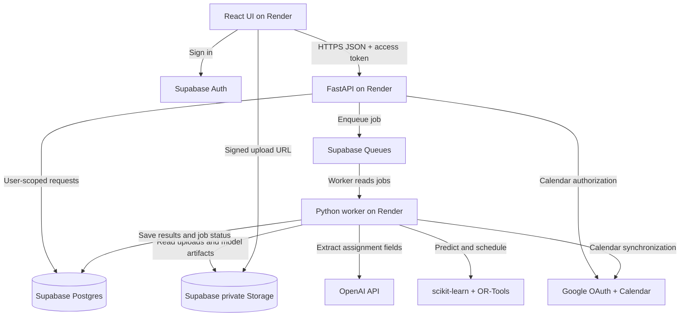

# Architecture

Purpose: describe the intended service topology, data flow, and the boundaries
that matter. Status: planned — none of this is deployed yet. Update this file
as each piece becomes real, and mark what is live.

## Components

| Part | Technology | Responsibility |
|---|---|---|
| Frontend | React + TypeScript + Vite, Tailwind, shadcn/ui, FullCalendar | Task entry, weekly calendar, timer, schedule approval, feedback |
| Frontend hosting | Render Static Site | Serves the built bundle over HTTPS |
| Backend API | Python + FastAPI + Pydantic on a Render Web Service | Request validation, authorization, JSON APIs, job creation |
| Worker | Same Python package, Render Background Worker | Slow work: imports, extraction, scheduling, training |
| Auth / data / files | Supabase Auth, Postgres, private Storage | Sign-in, records, uploads, model artifacts |
| Job queue | Supabase Queues | Durable job records consumed by the worker |
| Extraction | OpenAI Responses API with Structured Outputs | Assignment fields out of documents, as validated JSON |
| Prediction | scikit-learn (quantile regression), CPU | Typical and conservative duration estimates |
| Scheduling | Google OR-Tools CP-SAT | Feasible placement of work blocks |
| Calendar | Google Calendar API | Import busy times, export approved blocks |

The API and the worker are the same Python package deployed twice with
different entrypoints. Shared logic lives in plain functions so both can call
it.

## Data flow

## Boundaries that matter

**Identity vs. authorization.** The browser signs in through Supabase and sends
its access token to FastAPI. FastAPI verifies the JWT to establish identity, and
forwards the token on user-scoped Supabase requests so row-level security
restricts the student to their own rows.

**The worker bypasses RLS.** It holds backend-only credentials by necessity —
it acts without a user session. Therefore the worker must enforce ownership
itself, reading the owning user from the trusted job record rather than from
anything supplied by the client. This is the single most likely place for a
cross-user data leak.

**Sign-in OAuth vs. Calendar OAuth are separate flows.** Google sign-in is
handled by Supabase. Google Calendar access is a distinct authorization with
its own consent screen, exchanged by the backend, whose refresh token is stored
encrypted. Conflating them leaks calendar scope into every sign-in.

**Slow work never runs inside an HTTP request.** Import, extraction, scheduling,
and training all go through the queue. The API returns a `job_id`; the UI polls
`GET /jobs/{id}`. Queue consumption stays backend-only.

**Public vs. private configuration.** Any `VITE_`-prefixed variable is in the
shipped bundle and readable by anyone. The OpenAI key, privileged Supabase
credentials, the Google OAuth secret, and the token-encryption key live only in
hosting environment settings.

## Data model sketch

Core entities, to be defined properly in the first migration:

- `profiles` — student, timezone, preferences, availability
- `courses` — per-student course list
- `tasks` — assignments: title, course, due time, student estimate, status
- `calendar_events` — fixed commitments, imported or manual
- `schedule_blocks` — approved work blocks placed by the scheduler
- `work_sessions` — timer start/pause/resume/finish transitions
- `predictions` — prediction, model version, features at decision time
- `jobs` / `imports` — job status, source document, extraction results

Rules that constrain the schema: timestamps are UTC with a separate profile
timezone; durations are integer minutes; synthetic records are flagged so they
can be excluded from reported accuracy; and a work session against an unfinished
task is a lower bound, not a completed-duration label.

## Failure modes to design against

- A schedule approved against stale state. Revalidate conflicts on confirm and
  reject a plan whose underlying tasks or availability changed.
- A retried import creating duplicate assignments. Deduplicate on a stable key.
- A revoked Google token. Detect, surface, and stop syncing rather than failing
  silently in the worker.
- A promoted model that is worse than the one it replaced. Evaluate before
  promotion and keep the previous artifact for rollback.
