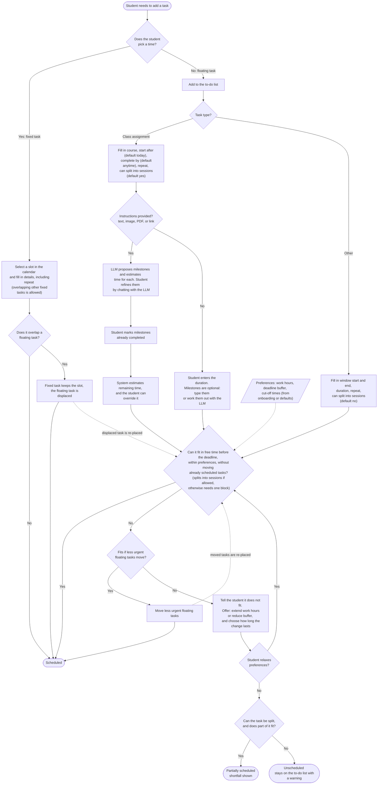
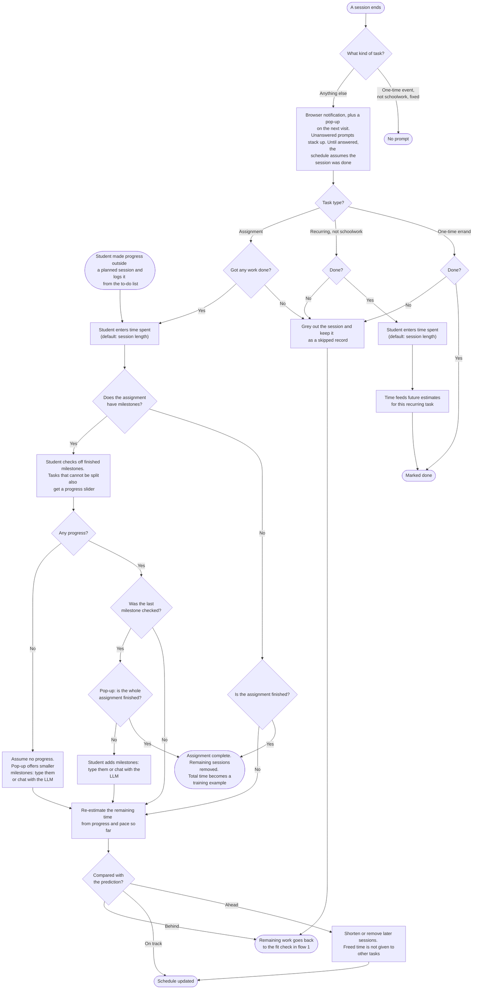

# MVP user flows

## Status

Proposed by Howard Xu on branch `hxu/ui-first-pass`. Not yet reviewed or
adopted by the team. Builds on the Vision section of the
[overview](../../docs/overview.md#vision).

Purpose: describe how a student interacts with the MVP when adding a task and
after a work session ends. Flow 1 ends with the task scheduled, partially
scheduled, or unscheduled. Flow 2 collects feedback for personal duration
estimates and adjusts the remaining schedule.

## Two kinds of task

- **Fixed:** the student gave it a time, the same way they would add an event in
  Google Calendar. The planner never moves it.
- **Floating:** the student added it to the to-do list without a time. The
  planner places it in free time before the deadline.

Students never label tasks. Giving a task a time is what makes it fixed. Dragging
a floating task to a new time also makes it fixed, and the student can unlock it
to let it float again.

## Flow 1: adding a task

Every path ends in one of three end states. A task that cannot be split is either
scheduled as one block or unscheduled; only splittable tasks can be partially
scheduled. The fit check decides the session split and the placement together, so
a task that passes already has its sessions. Dashed arrows show tasks re-entering
the fit check: a floating task displaced by a new fixed task, and less urgent
tasks moved to make room.

### What the student fills in

| Class assignment | Notes |
| --- | --- |
| Course | Required |
| Start after | Defaults to today |
| Complete by | Defaults to anytime |
| Instructions | Optional: pasted text, image, PDF, or link. Without them, the student enters a duration. |
| Milestones | Proposed by the LLM and refined by chatting with it, or typed in by the student |
| Completed milestones | Checked off from the milestone list |
| Repeat | Optional |
| Can split into sessions | Defaults to yes |

| Other task | Notes |
| --- | --- |
| Window start | Earliest day it can be done |
| Window end | Latest day it can be done |
| Duration | Entered by the student, in minutes |
| Repeat | Optional; works for fixed and floating tasks |
| Can split into sessions | Defaults to no, for errands or lab work done in one go |

### Example

A student pastes the prompt for a 1,500-word essay due Friday. The LLM proposes
four milestones (outline, draft, revise, citations) and estimates 270 minutes in
total. The student marks the outline as done, so 210 minutes remain. Because the
essay can be split, the fit check divides the time into sessions while placing
them in free time, outside the student's 10 PM cut-off and ahead of a one-day
buffer: Mon 2:00–3:30 PM (draft), Tue 7:00–8:00 PM (revise), Wed
11:00–11:30 AM (citations).

### Rules flow 1 depends on

1. The planner schedules without asking for approval. The student can view and
   adjust the schedule at any time.
2. Once a task is placed, the planner tries not to move it. It moves less urgent
   floating tasks only when a task would otherwise miss its deadline.
3. Fixed tasks may overlap each other. A fixed task always wins over a floating
   task in the same slot.
4. The student can override any time estimate.
5. When the student relaxes a preference to fit work in, they choose how long the
   change applies.
6. The student chooses whether a task can be split into sessions. A task that
   cannot be split needs one free block long enough for the whole task.
7. Milestones exist so the student can report progress, which lets the system
   re-estimate the remaining time. Tasks that cannot be split still get
   milestones.

## Flow 2: after a session

Flow 2 starts when a session ends, or when the student logs progress they made
outside a planned session from the to-do list. Missed sessions and work that
falls behind go back to flow 1's fit check, so they can end in the same "does not
fit" warning as a new task.

### Who gets which questions

| Task | Prompt | Asks |
| --- | --- | --- |
| Assignment, fixed or floating | Yes | Any work done, time spent, milestones (or slider if it can't be split) |
| Recurring task, not schoolwork | Yes | Done, time spent |
| One-time errand, floating | Yes | Done only |
| One-time event, not schoolwork, fixed | No | Nothing |

### Rules flow 2 depends on

1. Every eligible session gets a feedback prompt when it ends. Browser
   notifications plus a pop-up on the next visit is the tentative delivery; the
   exact mechanism is decided later.
2. Until a prompt is answered, the schedule assumes the session was done.
   Students are expected to follow their schedule. The tradeoff: a late "no"
   means the made-up work is placed later, and near a deadline it may no longer
   fit.
3. Missed sessions are greyed out, not deleted. Skipped sessions are data about
   when this student doesn't work.
4. Milestones are coarse in the MVP. A session with no milestone checked off
   counts as no progress.
5. Students can log progress from the to-do list at any time. The planner asks
   how long it took, then follows the same steps as a session prompt.
6. Session logs adjust the current assignment right away. Only a finished
   assignment's total time is used as a training example, because time logged on
   unfinished work is a lower bound, not a completed duration.
7. When the planner makes a schedule, it records each prediction with its inputs,
   so predictions can be compared with outcomes later.

## Still open

- Which preferences the planner must collect at onboarding, and what the defaults
  are. Tracked as question 8 in [open planning questions](../questions.md).
- How urgency is defined when choosing which floating tasks to move: nearest
  deadline, most remaining work, or a mix.
- How sessions are sized, for example a minimum and maximum session length.
