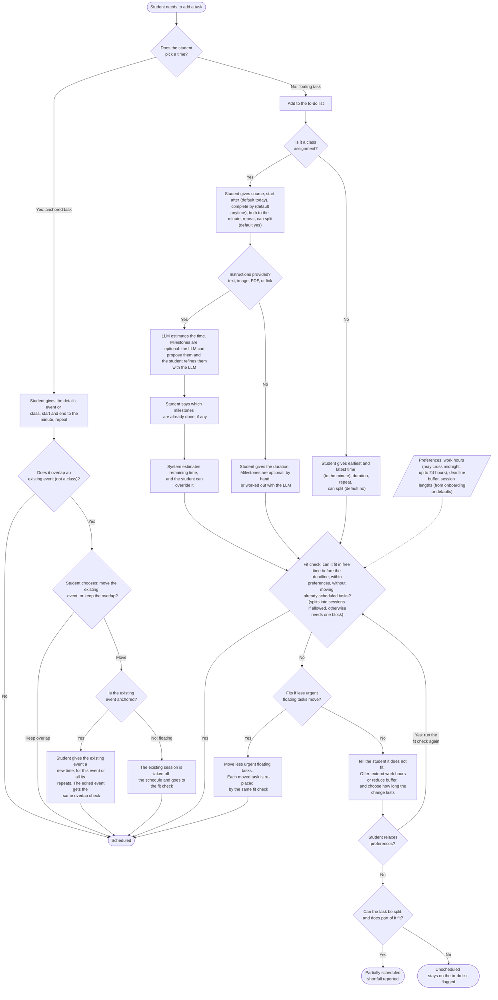
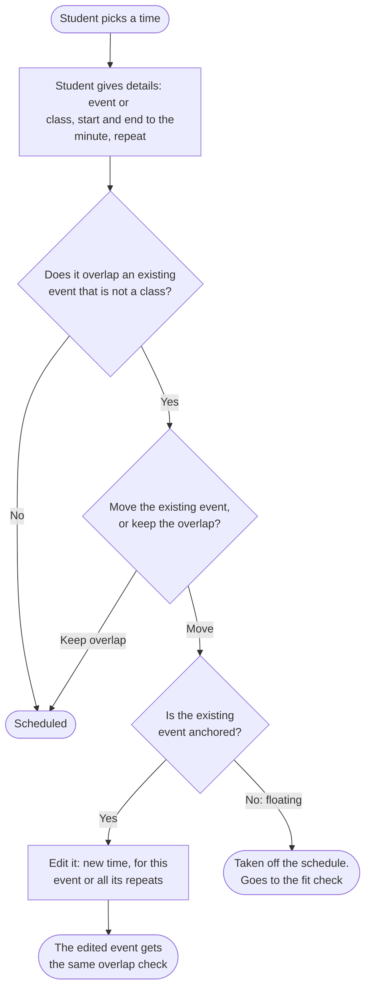
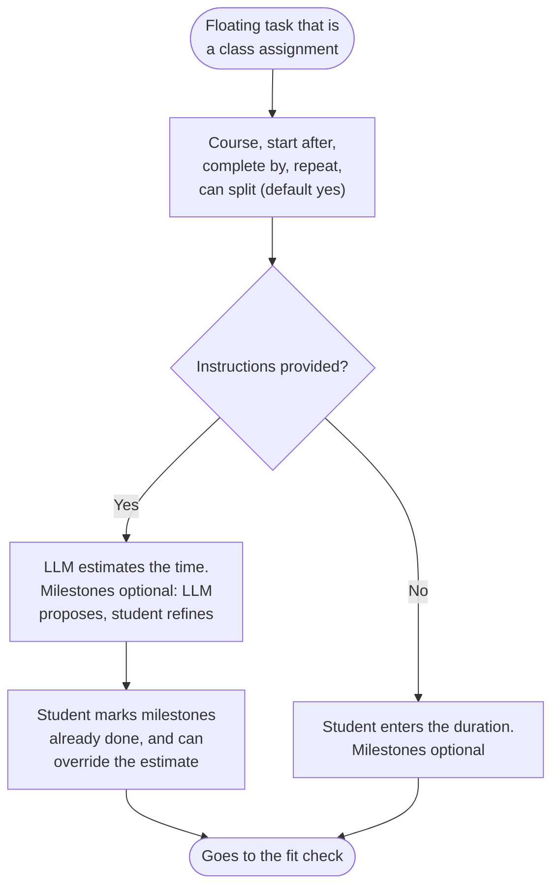
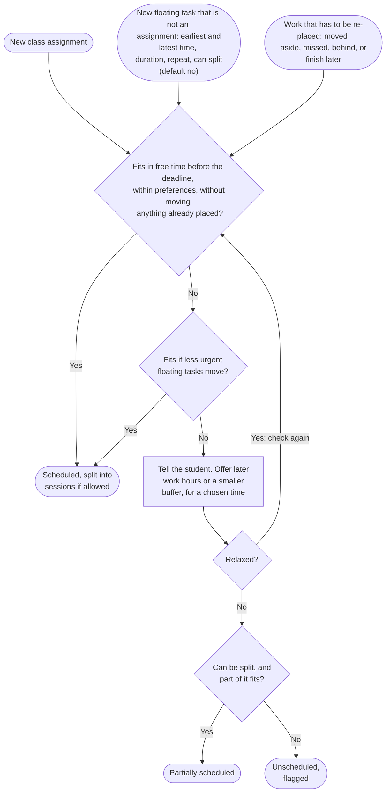
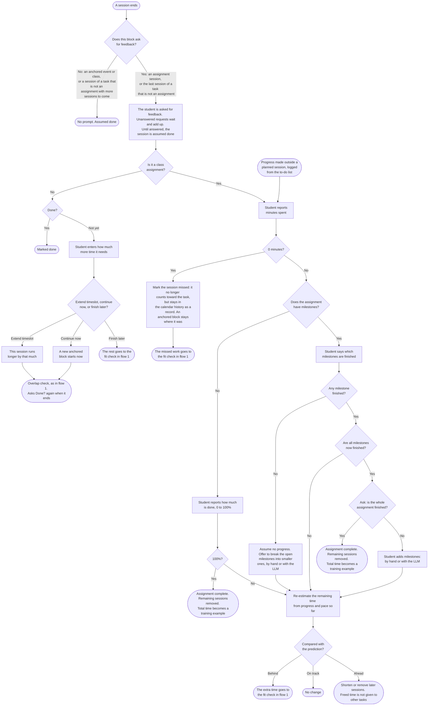
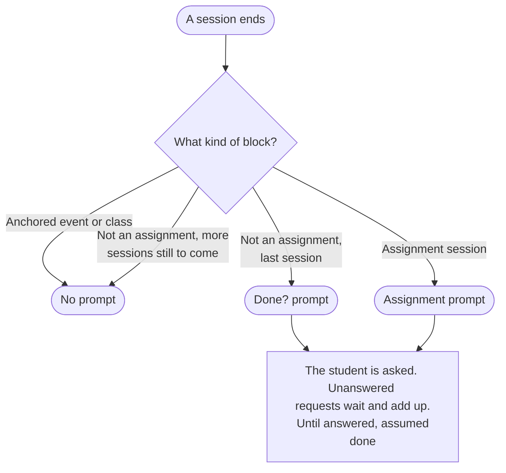
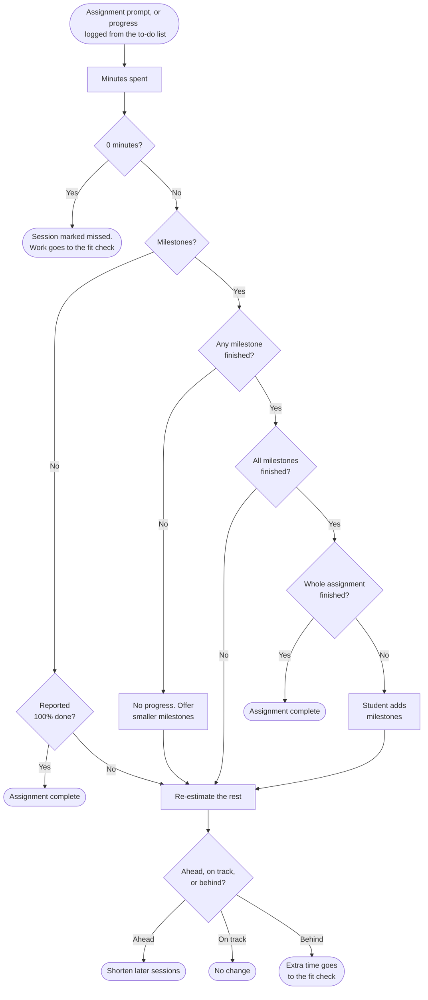
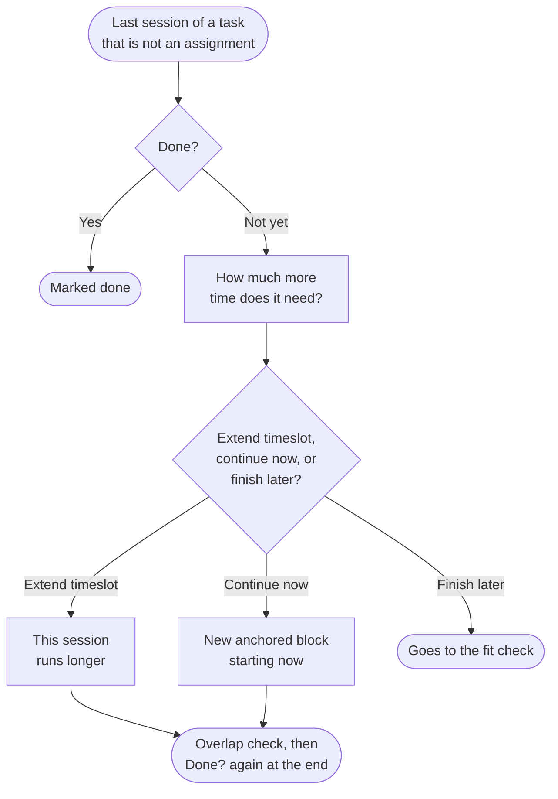

# MVP user flows

Status: Proposed by Howard Xu on branch `hxu/ui-first-pass`. Not yet reviewed or adopted
by the team.

**Source of truth for the logic that decides when and whether the system schedules a
task.** Every rule here is stated in terms of general inputs ("a session ends", "the
student chooses to keep the overlap", "the student has not given feedback yet") and
never in terms of what an input looks like on screen. What each input looks like in
practice (a pop-up, a button, a drag, closing a dialog) lives in
[web/DESIGN.md](../../web/DESIGN.md), along with every other on-screen
rule: layout, form checks, defaults in forms, wording, and how results are shown.

Example: "until the student gives feedback on a session, the session is assumed done"
belongs here. "Closing the feedback pop-up means no feedback yet" belongs in DESIGN.md.
If a screen is redesigned and the schedule would still come out the same, nothing in this
file should need to change.

Edit this file directly; propose changes the way you would for any other document. The flowcharts are
Mermaid code blocks, which GitHub renders as diagrams. The
[app](../../web/README.md) implements these rules, and
[flow-validation.md](flow-validation.md) checks it against every step of both master charts. For the UI/UX
goal and a map of every UI/UX file, see [ui-ux.md](ui-ux.md).

## Two kinds of task

- **Anchored.** The student gave it a time, the same way they would add an event in Google Calendar. The planner never moves it.

- **Floating.** The student added it to the to-do list without a time. The planner places it in free time before the deadline.

Students never label tasks. Giving a task a time is what makes it anchored. Moving a floating task to a new time also makes it anchored, and the student can let it float again. The student can also anchor a floating block where it is, without moving it. Anchored events, classes included, can be moved too: moving one changes its time, and for a repeating one the student chooses this event or every repeat that has not happened yet. How the student makes each of these choices is in [DESIGN.md](../../web/DESIGN.md).

## How to read the flowcharts

Each flow has one **master flowchart**: the complete flow in one picture, and the source
of truth. Under each master, **the flow in parts** breaks it into small charts that are
easier to follow. The parts are derived from the master: when you change a part, check
whether the master needs the same change, and when you change the master, check the
parts. If a part and its master ever disagree, the master wins.

Boxes that hand work to another part of a flow say so in their text ("goes to the fit
check") instead of drawing a long arrow back up the chart.

## Flow 1: adding a task

Every path ends in one of the three rounded end states. The overlap check runs whenever the student's own action creates an overlap: adding an event or moving one. Classes are overlapped silently. A task that cannot be split is either scheduled as one block or unscheduled; only splittable tasks can be partially scheduled. The fit check decides the session split and the placement together. The dashed arrow shows the preferences every fit check uses.

### Flow 1 in parts

**1a. Anchored task.** The student picks a time. The only question is what happens when
it overlaps something.

**1b. Class assignment.** A floating task that is a class assignment gathers an estimate
first. A floating task that is not an assignment skips straight to the fit check (1c).

**1c. Fill logic: the fit check.** Every floating task ends here: new ones, and work
that has to be re-placed.

## What the student provides

**Anchored task**

| Input | Notes |
| --- | --- |
| Type | Event, or Class (needs a course). Classes never prompt and are overlapped silently |
| Date, start, end | To the minute |
| Repeat | Optional; see Repeating tasks |
| Counts toward an assignment | Optional. This time counts as work on that assignment |

**Class assignment**

| Input | Notes |
| --- | --- |
| Course | Required |
| Start after | Date and time to the minute. Defaults to today, any time of day |
| Complete by | Date and time to the minute. Empty means anytime; a date alone means the end of that day |
| Instructions | Optional: pasted text, image, PDF, or link. With them, the LLM estimates the time; without them, the student enters a duration. The student can override either |
| Milestones | Optional. Proposed by the LLM and refined with it, or written by the student. Without milestones, progress is reported as a percentage done |
| Completed milestones | The student says which milestones are already done |
| Repeat | Optional. The whole window shifts every N days, weeks, or months |
| Can split into sessions | Defaults to yes |

**Not an assignment** (errands, chores, meals, social events, anything else)

| Input | Notes |
| --- | --- |
| Earliest | Date and time to the minute. A date alone means the start of that day |
| Latest | Date and time to the minute. A date alone means the end of that day |
| Duration | Entered by the student, in minutes |
| Repeat | Optional; see Repeating tasks |
| Can split into sessions | Defaults to no: most of these happen in one go |

## Repeating tasks

A repeat answers two separate questions: which days it happens on, and when on those days it can happen.

| Setting | Options |
| --- | --- |
| Repeats | Daily every N days; weekly every N weeks on selected days; monthly on the 1st, 2nd, 3rd, 4th, 5th, or last of any selected weekday ("the 2nd Tuesday", "the last Friday"). No yearly option |
| Selected days mean | **All of them**: one occurrence on each selected day. **Any one of them**: one occurrence per period, on whichever selected day fits (floating tasks only) |
| Each occurrence | At a set time, or floating between two times of day with a duration. A floating task's own time of day replaces the student's work hours for that task: gym between 5 and 9 PM is placed there even if work hours end at 8 PM |
| Ends | Never, on a date, or after N times |
| Assignments | No selected days. The first assignment's whole window (start after to complete by) moves forward every N days, weeks, or months. Example: start after Mon Oct 5, complete by Fri Oct 9, weekly: the next copy is Mon Oct 12 to Fri Oct 16. The planner still picks the session days inside each window. An assignment due more than once a week (a reading every Tue and Thu) is added as two weekly assignments |

- Example: Gym · weekly, Mon + Wed + Fri (all) (1 h between 5–9 PM)

- Example: Laundry · weekly, Sat or Sun (any one) (1 h between 10 AM–8 PM)

## Example: one essay, three sessions

A student gives the prompt for a 1,500-word essay due Friday. The LLM extracts four milestones (outline, draft, revise, citations) and estimates 270 minutes in total. The student marks the outline as done, so 210 minutes remain. Because the essay can be split, the fit check divides the time into sessions while placing them in free time, outside the student's 10 PM cut-off and ahead of a one-day buffer.

- Example: Mon 2:00–3:30 PM (Draft)

- Example: Tue 7:00–8:00 PM (Revise)

- Example: Wed 11:00–11:30 AM (Citations)

## Rules flow 1 depends on

1. The planner schedules without asking for approval. The student can view and adjust the schedule at any time.
2. Once a task is placed, the planner tries not to move it. It moves less urgent floating tasks only when a task would otherwise miss its deadline.
3. Students may overlap anything. When the student's own action creates an overlap, they choose to move the existing event or keep the overlap. A moved anchored event is edited by the student, for this event or all its repeats; "all" changes only repeats that have not happened yet. A moved floating session is re-placed by the planner. When one action overlaps several events, the student is asked about each one. Classes are overlapped silently.
4. Classes are anchored events with a course. They never prompt. Deleting one removes that lecture, or that lecture and all later ones in its series. Labs are their own series.
5. The student can override any time estimate.
6. When the student relaxes a preference to fit work in, they choose how long the change applies.
7. The student chooses whether a task can be split into sessions. A task that cannot be split needs one free block long enough for the whole task.
8. Milestones exist so the student can report progress, which lets the system re-estimate the remaining time. Tasks that cannot be split still get milestones.

## Flow 2: after a session

Flow 2 starts when a session ends, or when the student logs progress they made outside a planned session from the to-do list. Anchored events never move: a missed anchored block is only marked missed, and for an assignment the time it still needs is planned as floating work. Sessions of tasks that are not assignments are never marked missed; after the last one, the student says how much time is left instead. Work that falls behind goes back to flow 1's fit check, so it can end in the same "does not fit" outcome as a new task.

### Flow 2 in parts

**2a. Who gets asked, and when.**

**2b. Assignment feedback.** Also used when the student logs progress from the to-do list.

**2c. Feedback for a task that is not an assignment.**

## Who gets which questions

| Block | Prompt | Asks |
| --- | --- | --- |
| Assignment: floating session, or anchored time set aside for it | Yes | Minutes spent (0 means none: the session is marked missed and the work rescheduled), then which milestones are finished or (without milestones) the percentage done |
| Not an assignment: the last planned session | Yes | Done? If not yet: how much more time, then Extend timeslot, Continue now, or Finish later |
| Not an assignment: an earlier session, with more to come | No | Nothing; assumed done |
| Anchored events and classes not tied to an assignment, one-time or repeating | No | Nothing |

## Rules flow 2 depends on

1. Every eligible session asks the student for feedback when it ends. How the request reaches the student is in DESIGN.md.
2. Until a prompt is answered, the schedule assumes the session was done. Students are expected to follow their schedule. The tradeoff: a late "no" means the made-up work is placed later, and near a deadline it may no longer fit.
3. Missed assignment sessions are marked missed and kept as a record, not deleted: they no longer count toward the task. Missed sessions are data about when this student doesn't work. Anchored blocks are never rescheduled. Sessions of tasks that are not assignments are never marked missed: for them the system does not care whether the time was productive, only how much is left.
4. Milestones are coarse in the MVP. For tasks with milestones, a session with no milestone finished counts as no progress. Tasks without milestones report progress as a percentage done instead.
5. Students can log progress from the to-do list at any time. The planner asks how long it took, then follows the same steps as a session prompt. A task that is not an assignment can also be marked done from the to-do list at any time; it is then complete (see Completion in the rule reference).
6. A task that is not an assignment asks "Done?" only after its last planned session; earlier sessions are assumed done. If not yet, the student enters how much more time it needs and picks **Extend timeslot** (this session runs longer: shopping took 20 minutes more), **Continue now** (a new anchored block starts right away), or **Finish later** (the fit check places the rest: the bathroom still needs 30 minutes). Extending or continuing runs the overlap check, and the block asks "Done?" again when it ends. The extra time does not change future estimates; the student changes the task's usual duration by hand, for this one or all upcoming.
7. Session logs adjust the current assignment right away. Only a finished assignment's total time is used as a training example, because time logged on unfinished work is a lower bound, not a completed duration.
8. When the planner makes a schedule, it records each prediction with its inputs, so predictions can be compared with outcomes later.

## Rule reference

The detailed rules behind both flows. Items marked **Placeholder** are first guesses the team will refine. Items marked **Prototype limit** exist only to keep the prototype simple and will be removed.

| Area | Rule |
| --- | --- |
| Placing work (the fit check) | **Placeholder:** the placement strategy (front-load or spread out, and how moved work is re-placed) is undecided; see [Still open](#still-open) and project-wide [question 9](../questions.md). Today: sessions use the preferred length, within the shortest and longest session. A leftover shorter than the shortest session joins the last session; a session may shrink to fit a free slot that is at least the shortest length. Work spreads out: one session per day first, then two, then as many as fit. Earlier days first, and within a day the slot closest to the student's peak-energy hours. Every session is followed by the break length. Nothing is placed in the past, before the task's earliest time (to the minute), or after its deadline. A floating session the student moves aside for an overlap is placed from scratch by these same rules, not near its old time. |
| Deadline | For assignments, the complete-by time minus the deadline buffer. For other tasks, the latest time. |
| Time of day | A task with its own time of day (gym between 5 and 9 PM) uses that window instead of work hours. An "any one of" repeat uses only its selected weekdays. |
| Work hours | Any start and end. An end at or before the start is the next day (10 AM to 3 AM); the same time means all 24 hours. Hours belong to the day they start. |
| Urgency and making room | Urgency is the nearest deadline. To make room, the planner moves the least urgent floating task first and adds more only while the new work still does not fit. All or nothing: if a moved task cannot be re-placed before its own deadline, nothing moves. A task that lands back in the same slots is not reported as moved. Anchored blocks never move. |
| Relaxing preferences | When work does not fit, the student is offered a later cut-off, up to all 24 hours (it can cross midnight), and a smaller deadline buffer, down to none. The change lasts for this task only, this week, the next two weeks, or until the student changes it. Before choosing, the student can see whether the task would then fit. A change that is still not enough leads to the same offer again. |
| Anytime | **Prototype limit:** work with no deadline is placed within 28 days of today, or of the task's own start if later. In the product, anytime should mean anytime. |
| Initial estimate | The minutes to schedule for a new assignment: the student's override if given; otherwise the open milestones' total; otherwise, with instructions, the LLM's estimate; otherwise the student's own duration. Rounded to 5 minutes. A task that is not an assignment uses the student's duration. |
| Re-estimation | **Placeholder:** with milestones, pace = minutes taken divided by the estimate of the milestones just finished, averaged 50/50 with the previous pace and kept between 0.5 and 2; remaining = open milestone minutes times pace. Without milestones, remaining = total times (1 minus the fraction done). A change within 10% or 10 minutes leaves the plan alone. Ahead trims the latest sessions first. Only time before the due date counts toward a task, and sessions still waiting for feedback count as done. A student's override is kept through later updates. |
| Repeats | "Any one of" gives one window per week or month, from the first selected day to the last. Monthly "the 2nd Tuesday" is the second Tuesday of each month; "last" is the final one. Editing "all events" moves every repeat that has not happened yet by the same amount; past ones stay. **Prototype limit:** a repeat that never ends is created 8 weeks ahead. |
| Not done yet (tasks that are not assignments) | The student gives the minutes still needed. Extend timeslot: the session ends that much later and becomes anchored; if the new end has already passed, "Done?" is asked again right away. Continue now: the session counts as done and a new anchored block starts now (rounded up to 5 minutes). Finish later: the session counts as done and the remaining minutes go through the fit check. In every case the remaining minutes replace what was left, so other sessions of the same task are trimmed or added to match. |
| Choices not made | If the student does not choose to move an overlapped event, the overlap is kept. If the student does not relax a preference, preferences stay as they are and the task ends partially scheduled or unscheduled. A feedback request with no answer leaves the session assumed done (flow 2 rule 2). Which on-screen actions count as not choosing is in DESIGN.md. |
| Deleting | Deleting a repeating event removes just this one, or this one and every later one. Deleting a task removes its sessions. Time freed by a deletion stays free: the planner does not pull other work earlier. |
| Completion | Future sessions are removed, and sessions still waiting for feedback are marked done. A finished assignment's predicted and actual total time become a training example; tasks that are not assignments never do. |
| Preferences | **Placeholder:** work hours (default 9 AM to 8 PM), preferred session (50 min), shortest (30), longest (120), break (10), peak energy (morning), deadline buffer (1 day). Which preferences to collect, and their defaults, are for the team to refine. Changing a preference does not move work that is already scheduled; it applies to work placed from then on. |
| LLM | **Placeholder in the prototype:** keyword rules stand in for the LLM's milestones, time estimates, and chat. Uploaded files and links are not read. |

## Still open

- Which preferences the planner collects at onboarding, and their defaults: project-wide [question 8](../questions.md). The prototype's versions are placeholders in the rule reference above.
- Placement strategy: front-load work into the nearest free time or spread it out before the deadline, possibly as a student preference (a slider), and whether a floating session moved aside by an overlap is re-placed near its old time instead of from scratch: project-wide [question 9](../questions.md). The prototype always places from scratch with the fit-check rule above.
- Which scheduling inputs a student can set on a single task, with the general preferences as defaults (for example its session length, or front-load versus spread out): project-wide [question 10](../questions.md). Today only time of day and whether the task can split are set per task.
- The re-estimation math. The prototype's version is a placeholder in the rule reference above.
- Removing the prototype limits listed in the rule reference ("anytime" capped at 28 days, never-ending repeats created 8 weeks ahead).

Defaults chosen while building the prototype, to confirm or change: a task's own time of day replaces work hours; "any one of" days is for floating tasks only; "all repeats" edits skip past occurrences; one overlap question per overlapped event (a "same answer for every repeat" option may be needed); no yearly repeats; the initial-estimate order; deleting and changing preferences leave scheduled work in place; marking a task that is not an assignment done from the to-do list.
